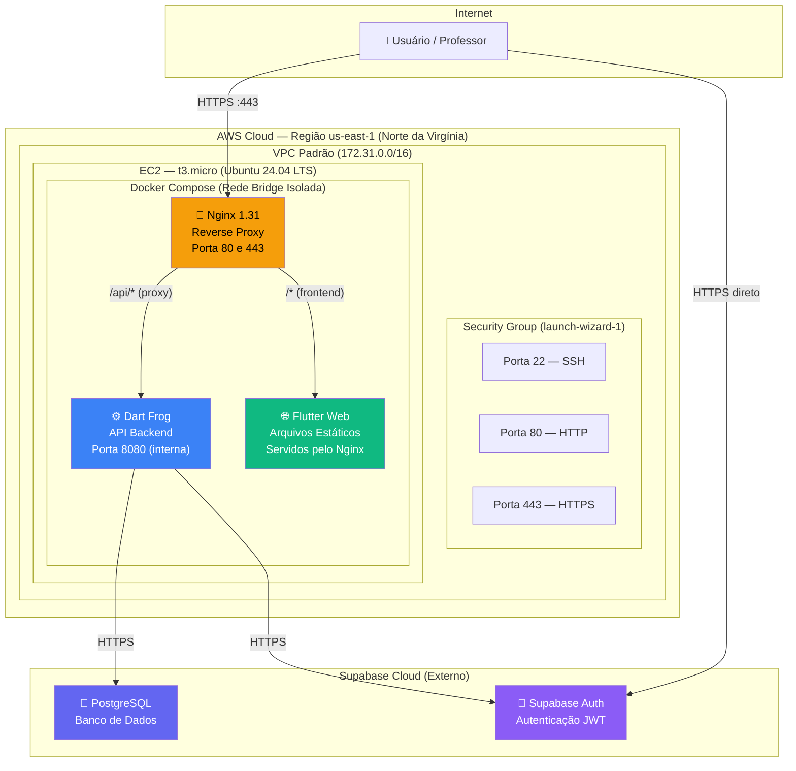

# Relatório de Infraestrutura — DeliveryOS na AWS EC2

> **Aluno:** Pedro Lucas Santos  
> **Sistema:** DeliveryOS — Sistema de Gestão para Restaurantes e Delivery  
> **URL de Acesso:** https://54.221.132.160.sslip.io  
> **Data do Deploy:** 16/06/2026

---

## 1. Diagrama de Arquitetura da Infraestrutura

---

## 2. Descrição dos Principais Elementos da Infraestrutura

### 2.1 Amazon EC2 (Elastic Compute Cloud)
O EC2 é o serviço de computação da AWS que fornece máquinas virtuais na nuvem. Utilizamos uma instância do tipo **t3.micro** (2 vCPUs, 1 GB RAM), com o sistema operacional **Ubuntu Server 24.04 LTS**. Essa instância hospeda toda a aplicação conteinerizada.

### 2.2 VPC e Security Groups
A **VPC padrão** da conta foi utilizada para isolamento de rede. O **Security Group** atua como um firewall virtual. Configuramos as seguintes regras:
- **TCP 22:** Acesso remoto via SSH para administração.
- **TCP 80 e 443:** Acesso HTTP/HTTPS ao site.

### 2.3 Docker e Docker Compose
A plataforma de conteinerização Docker foi usada para empacotar cada componente em um ambiente isolado. O **Docker Compose** orquestra dois serviços:
- **`deliveryos-backend`:** Roda a API REST em Dart.
- **`deliveryos-nginx`:** Roda o Nginx como Proxy Reverso e servidor web.

### 2.4 Nginx (Reverse Proxy) e Certificado SSL
O Nginx atua como o **ponto único de entrada** da aplicação:
1. Serve os arquivos compilados do Flutter Web (HTML, JS, CSS).
2. Atua como proxy reverso redirecionando rotas `/api/*` para o Backend Dart na porta interna.
3. Possui **Certificado SSL (HTTPS)** configurado via Let's Encrypt atrelado ao domínio gratuito `sslip.io`.

### 2.5 Supabase (Banco de Dados)
O Supabase atua como Backend as a Service externo gerenciado, provendo PostgreSQL relacional e servidor de autenticação JWT, integrando-se nativamente com o Flutter e Dart Frog.

---

## 3. Principais Desafios na Implementação

1. **Restrições de Memória do t3.micro:** Apenas 1 GB de RAM causava falhas (*Out of Memory*) durante o build das imagens Docker. 
   - **Solução:** Configuração manual de um arquivo de SWAP de 2GB no Linux, expandindo a memória virtual e permitindo a conclusão da compilação.
2. **Compilação Cross-Platform (Windows → Linux):** 
   - **Solução:** Uso do Docker *multi-stage build* para compilar o Dart nativamente em arquitetura x86_64 diretamente no EC2, gerando um binário leve (~10MB).
3. **Bloqueio de Arquivos Sensíveis (.env):** O Flutter Web faz uma requisição ao arquivo `assets/.env` para ler as variáveis públicas, mas por padrão o Nginx bloqueia arquivos ocultos.
   - **Solução:** Criação de uma regra de exceção no `nginx.conf` liberando acesso estritamente à rota `/assets/.env`.

---

## 4. Atributos de Qualidade na Implementação

### 4.1 Segurança
Todo o tráfego externo é criptografado usando **HTTPS (SSL/TLS)** via Let's Encrypt. O backend na porta 8080 não é exposto publicamente, existindo apenas na rede isolada do Docker.

### 4.2 Performance
- O backend em Dart Frog usa compilação **Ahead-of-Time (AOT)**, operando via código de máquina nativo ao invés de interpretação, entregando respostas ultrarrápidas.
- O Nginx foi configurado com compressão **Gzip** ativada e **Cache de 7 dias** para assets de imagens e estilos, reduzindo o tráfego da rede.

### 4.3 Escalabilidade (E a explicação sobre Cluster)
Atualmente a aplicação roda em um **único container de backend**. Para o contexto de um restaurante padrão e limitações de hardware (1GB RAM), **isso é o ideal**.
Linguagens como Node.js ou Python muitas vezes requerem módulos de *Cluster* para balancear a carga em múltiplos processos (uma vez que não lidam tão bem com requisições single-thread interpretadas). O Dart compilado (AOT) lida perfeitamente com picos de tráfego intensos em apenas um processo nativo.
Caso a aplicação necessite de "clustering" (escalabilidade horizontal) no futuro, a infraestrutura já está pronta: basta executar `docker compose up --scale backend=4` e o Nginx distribuirá as requisições (Load Balancing) automaticamente entre as cópias do servidor. O banco de dados (Supabase) já lida nativamente com o agrupamento de dados na nuvem da AWS (Auto-Scaling).

### 4.4 Portabilidade
A forte adoção do Docker garante que o projeto é agnóstico ao provedor. Pode ser migrado do AWS EC2 para Azure, Google Cloud ou rodado localmente sem alterar uma linha de código.
