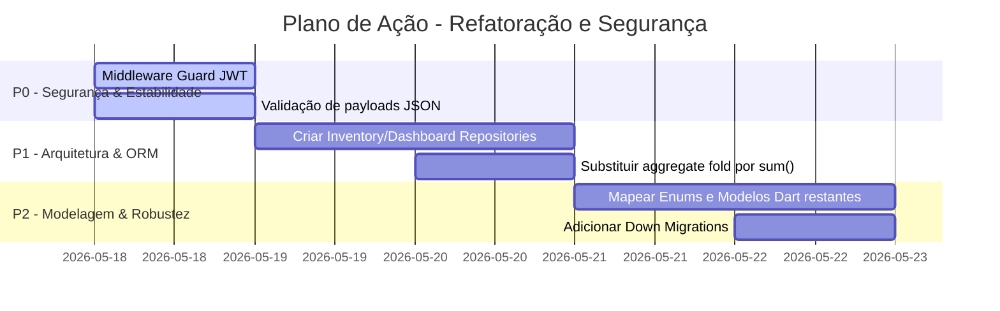

# 🔍 Relatório de Auditoria Técnica Relacional e Arquitetural (Prisma & Dart)

**Projeto:** Delivery OS — Backend Dart  
**Padrão de Referência:** Diretrizes Relacionais do Prisma ORM + Clean Architecture + Segurança Corporativa (V4.0)  
**Data:** 2026-05-18  
**Auditor:** Antigravity AI  

---

## 1. Modelagem de Dados

Esta seção analisa a representação dos modelos de domínio Dart em relação às tabelas e restrições relacionais do PostgreSQL (Supabase), avaliando tipos, enums e integridade das chaves.

### ✅ Conforme
* **Modelagem Consistente de Entidades:** O modelo `Pedido` em [pedido.dart](file:///c:/Users/pedro/Downloads/deliveryos%20(3)/backend_dart/lib/models/pedido.dart) mapeia de forma fidedigna todas as propriedades da tabela `public.pedidos`, respeitando a correspondência de tipos do PostgreSQL para Dart (`DECIMAL` -> `double`, `VARCHAR/TEXT` -> `String`, `TIMESTAMP` -> `DateTime`).
* **Suporte a Nulabilidade:** Atributos como `clienteId`, `observacoes` e `updatedAt` estão corretamente definidos como opcionais (`String?`, `DateTime?`), espelhando a ausência da restrição `NOT NULL` no banco de dados relacional.
* **Integridade Referencial Declarada:** O arquivo [0001_sprint2_1.sql](file:///c:/Users/pedro/Downloads/deliveryos%20(3)/supabase/migrations/0001_sprint2_1.sql) possui constraints relacionais fortes:
  * Relação 1:N entre `profiles` e `auth.users` com `ON DELETE CASCADE`.
  * Relação N:N entre `cardapio` e `estoque` resolvida via tabela associativa `ficha_tecnica` com restrição de unicidade composta (`UNIQUE(cardapio_id, estoque_id)`).

### ⚠️ Atenção
* **Ausência de Enums Tipados no Dart:** Embora existam os enums `status_pedido` (`novo`, `preparando`, `pronto`, `concluido`, `cancelado`) e `tipo_pedido` (`mesa`, `balcao`, `delivery`) no banco de dados PostgreSQL, o Dart está utilizando strings brutas (`String`) para representá-los nos modelos e repositórios.
  * *Justificativa:* O uso de strings brutas impede a verificação em tempo de compilação, abrindo margem para erros ortográficos e falhas de negócio silenciosas.
  * *Melhoria Recomendada:* Criar enums fortemente tipados no Dart com suporte à serialização e desserialização robusta.

### ❌ Crítico
* **Modelagem Incompleta do Domínio:** Os demais modelos de dados importantes definidos no schema do banco (`clientes`, `fornecedores`, `estoque`, `cardapio`, `ficha_tecnica`, `financeiro`) **não possuem representação em classes Dart** na pasta `lib/models/`. Os serviços recebem e manipulam diretamente estruturas genéricas `Map<String, dynamic>`.
  * *Exemplo do Problema:* No arquivo [menu_service.dart](file:///c:/Users/pedro/Downloads/deliveryos%20(3)/backend_dart/lib/services/menu_service.dart#L12), o método `createMenuItem` recebe uma lista genérica de receitas: `List<Map<String, dynamic>> receita`. Qualquer chave errada (ex: `estoqueId` em vez de `estoque_id`) causará falha em produção apenas em tempo de execução.
  * *Correção em Dart:*
    ```dart
    // lib/models/ficha_tecnica.dart
    class FichaTecnicaIngrediente {
      final String estoqueId;
      final double quantidadeNecessaria;

      const FichaTecnicaIngrediente({
        required this.estoqueId,
        required this.quantidadeNecessaria,
      });

      Map<String, dynamic> toJson() => {
        'estoque_id': estoqueId,
        'quantidade_necessaria': quantidadeNecessaria,
      };
    }
    ```

---

## 2. Schema e Migrações

Esta seção avalia o histórico de evolução do banco de dados relacional, a reversibilidade das alterações e o alinhamento com a fonte da verdade do projeto.

### ✅ Conforme
* **Versionamento Incremental e Ordenado:** As migrações na pasta [supabase/migrations](file:///c:/Users/pedro/Downloads/deliveryos%20(3)/supabase/migrations) utilizam a convenção de nomenclatura sequencial padrão (`0001_...`, `0002_...`), facilitando a execução e o rastreamento histórico por ferramentas de CI/CD e CLI.
* **Isolamento de Alterações de RLS:** A migração de segurança e políticas RLS (`0002_sprint2_2_rls.sql`) está separada da migração de tabelas base (`0001_sprint2_1.sql`), permitindo aplicar e testar a integridade estrutural antes de aplicar as travas de acesso.
* **Automação do Histórico Temporal:** O uso de triggers e funções SQL (`update_updated_at_column`) garante que o campo `updated_at` seja atualizado de forma totalmente transparente e consistente na camada de banco de dados, independentemente do cliente que realiza a modificação.

### ⚠️ Atenção
* **Falta de Scripts de Reversão (Down Migrations):** As migrações contêm apenas as diretivas de criação (`Up`), não definindo instruções de rollback (`Down`) equivalentes para o caso de necessidade de reversão segura em ambiente de staging ou homologação.
  * *Justificativa:* Se uma migração falhar no meio em produção, a ausência de rollback explícito pode deixar o banco em estado inconsistente ou exigir intervenção manual arriscada.

### ❌ Crítico
* **Falta de Integridade Referencial em Exclusões no Financeiro:** A tabela `public.financeiro` possui uma relação com `public.pedidos` (`pedido_id UUID REFERENCES public.pedidos(id) ON DELETE SET NULL`). No entanto, se um pedido for excluído, os lançamentos financeiros vinculados a ele perdem a referência sem nenhum log ou histórico associado, gerando buracos contábeis silenciosos no CMV do restaurante.
  * *Correção no SQL:* Alterar a constraint para impedir exclusões órfãs ou gerar um trigger de auditoria contábil.
    ```sql
    -- O ideal é não permitir a exclusão física de pedidos que possuam lançamentos financeiros
    ALTER TABLE public.financeiro
    DROP CONSTRAINT IF EXISTS financeiro_pedido_id_fkey,
    ADD CONSTRAINT financeiro_pedido_id_fkey 
      FOREIGN KEY (pedido_id) REFERENCES public.pedidos(id) 
      ON DELETE RESTRICT;
    ```

---

## 3. Camada de Acesso a Dados (Prisma Client Equivalente)

Esta seção analisa a implementação dos Repositórios e a forma como as chamadas do cliente Supabase são isoladas da lógica pura de negócio.

### ✅ Conforme
* **Isolamento de Lógica no Repositório:** A classe [OrderRepository](file:///c:/Users/pedro/Downloads/deliveryos%20(3)/backend_dart/lib/repositories/order_repository.dart) implementa perfeitamente o padrão Repository, contendo apenas consultas SQL mapeadas pela API PostgREST do Supabase, livre de cálculos matemáticos ou decisões de negócio.
* **Desacoplamento e Testabilidade:** O construtor de [OrderService](file:///c:/Users/pedro/Downloads/deliveryos%20(3)/backend_dart/lib/services/order_service.dart#L9) recebe a interface `OrderRepository` via injeção de dependências opcional, viabilizando o isolamento total das regras de CMV e estoque através de dublês de teste (Mocks) na suíte de testes automatizados.
* **Segurança de Tipos no Retorno de RPCs:** As funções executadas remotamente (ex: `processar_baixa_estoque_pedido` e `calcular_cmv_periodo`) estão encapsuladas no repositório com validações explícitas de sucesso e tratamento de exceção.

### ⚠️ Atenção
* **Cast Inseguro de Retornos Assíncronos:** Diversos métodos utilizam coerção de tipo direta (ex: `pedidosResponse as List<dynamic>` em [report_repository.dart](file:///c:/Users/pedro/Downloads/deliveryos%20(3)/backend_dart/lib/repositories/report_repository.dart#L14) e [dashboard_service.dart](file:///c:/Users/pedro/Downloads/deliveryos%20(3)/backend_dart/lib/services/dashboard_service.dart#L25)).
  * *Justificativa:* Caso o Supabase retorne um objeto inesperado ou formato malformado devido a uma alteração de schema, o Dart lançará um erro de runtime do tipo `TypeError` em vez de uma exceção tratável de parse de dados.

### ❌ Crítico
* **Bypass da Camada de Repositório por Outros Serviços:** Enquanto `OrderService` usa a abstração do repositório, os serviços [DashboardService](file:///c:/Users/pedro/Downloads/deliveryos%20(3)/backend_dart/lib/services/dashboard_service.dart) e [InventoryService](file:///c:/Users/pedro/Downloads/deliveryos%20(3)/backend_dart/lib/services/inventory_service.dart) chamam diretamente a API fluente do `SupabaseClient` (`_supabase.from(...).select(...)`). Isso quebra a consistência do padrão de projeto e impossibilita testar essas regras de negócio de forma isolada sem disparar chamadas de rede ou realizar stubs extremamente complexos e frágeis do cliente Supabase.
  * *Correção em Dart:* Criar `InventoryRepository` e `DashboardRepository` correspondentes para isolar as chamadas.
    ```dart
    // lib/repositories/inventory_repository.dart
    class InventoryRepository {
      final SupabaseClient _supabase;
      InventoryRepository(this._supabase);

      Future<List<Map<String, dynamic>>> fetchLowStockItems() async {
        final response = await _supabase.rpc('get_low_stock_items');
        return List<Map<String, dynamic>>.from(response as List);
      }
    }
    ```

---

## 4. Performance e Boas Práticas

Esta seção analisa a eficiência das queries geradas, carregamentos na memória e políticas de paginação e indexação.

### ✅ Conforme
* **Consultas Otimizadas na Fonte (RPC):** O cálculo do CMV do período e a verificação de estoque mínimo não são feitos trazendo todos os registros para a memória do servidor Dart. Toda a computação complexa de junções e agregações (`SUM`, `JOIN` de 4 tabelas) é delegada diretamente para o motor relacional do PostgreSQL através da RPC `calcular_cmv_periodo` e `get_low_stock_items`.
* **Projeção de Colunas Limitada:** As consultas limitam os campos selecionados ao estritamente necessário (ex: `.select('id, valor_total')` em [dashboard_service.dart](file:///c:/Users/pedro/Downloads/deliveryos%20(3)/backend_dart/lib/services/dashboard_service.dart#L20)), economizando consideravelmente a banda de rede e a alocação de memória no servidor em comparação com um `SELECT *` irrestrito.

### ⚠️ Atenção
* **Falta de Paginação nos Endpoints Listados:** Consultas como a busca de itens de cardápio em [menu_service.dart](file:///c:/Users/pedro/Downloads/deliveryos%20(3)/backend_dart/lib/services/menu_service.dart#L103) não delimitam tamanho de página (`limit`) ou cursor de paginação.
  * *Justificativa:* À medida que o cardápio e a lista de pedidos crescerem no restaurante do mundo real, a resposta HTTP ficará progressivamente mais pesada, lenta e propensa a estourar o limite de tempo (timeout).
  * *Melhoria Recomendada:* Adicionar parâmetros de offset e limit padrão nas rotas de listagem.

### ❌ Crítico
* **Risco de N+1 Implícito no Loop de Lançamentos Financeiros:** No arquivo [dashboard_service.dart](file:///c:/Users/pedro/Downloads/deliveryos%20(3)/backend_dart/lib/services/dashboard_service.dart#L52), a busca de despesas filtra por data, mas traz todos os registros brutas para fazer um fold na memória da aplicação Dart. Se o volume de transações financeiras for muito alto, a aplicação sofrerá gargalo de CPU e memória. Toda agregação e somatório financeiro deve ser delegada ao banco de dados relacional usando cláusulas `sum` ou agregados agrupados.
  * *Correção em Dart / SQL:*
    ```dart
    // Em vez de puxar todas as despesas brutas para fazer .fold(...) no Dart:
    // ✅ Utilizar a agregação diretamente na query do Supabase
    final response = await _supabase
        .from('financeiro')
        .select('valor.sum()') // Agregação nativa PostgREST
        .eq('tipo', 'DESPESA')
        .gte('data_transacao', dataInicio.toIso8601String())
        .lte('data_transacao', dataFim.toIso8601String())
        .single();
    final totalDespesas = (response['sum'] as num?)?.toDouble() ?? 0.0;
    ```

---

## 5. Segurança

Esta seção inspeciona o isolamento de dados por usuário (multitenancy), controle de acesso a tabelas sensíveis e vazamento de informações.

### ✅ Conforme
* **Políticas de RLS Robustas no PostgreSQL:** As políticas definidas em [0002_sprint2_2_rls.sql](file:///c:/Users/pedro/Downloads/deliveryos%20(3)/supabase/migrations/0002_sprint2_2_rls.sql) garantem que nenhum inquilino (tenant) consiga ler ou escrever dados de outro usuário. A restrição baseia-se estritamente na validação de `auth.uid() = user_id`.
* **Proteção Elevada com Security Definer:** As RPCs transacionais críticas que modificam o estoque (`processar_baixa_estoque_pedido`) utilizam `SECURITY DEFINER` com `search_path` fixado em `public`, anulando vulnerabilidades clássicas de injeção de caminho ou elevação de privilégios maliciosos.
* **Remoção de Acesso Público:** A migração [0004_security_fixes.sql](file:///c:/Users/pedro/Downloads/deliveryos%20(3)/supabase/migrations/0004_security_fixes.sql) revoga completamente as permissões das conexões não autenticadas (`anon`) sobre as tabelas sensíveis de cardápio, estoque, finanças e perfis.

### ⚠️ Atenção
* **Falta de RLS na Tabela `pedido_itens`:** Embora a tabela `pedidos` esteja protegida por RLS, a tabela associativa `pedido_itens` depende da herança do RLS via banco ou pode estar vulnerável se acessada de forma isolada sem filtros adequados de relacionamento.
  * *Justificativa:* Se um atacante descobrir o ID de um prato ou o ID de item, ele não deve ter meios de ler os itens do pedido diretamente sem estar autenticado no pedido correspondente.

### ❌ Crítico
* **Ausência de Validação de Token no Middleware do Backend:** O middleware global do Dart Frog [routes/api/_middleware.dart](file:///c:/Users/pedro/Downloads/deliveryos%20(3)/backend_dart/routes/api/_middleware.dart) não valida a assinatura JWT do header `Authorization: Bearer <token>` nas requisições HTTP recebidas do cliente antes de repassar a execução para as rotas e serviços. Toda a segurança está delegada exclusivamente à falha que o Supabase lançará ao tentar persistir. Isso significa que requisições malformadas ou não autenticadas chegam até a camada de serviço, gerando consumo desnecessário de processamento e conexões de banco de dados.
  * *Correção em Dart:*
    ```dart
    // Criar um guard de autenticação no routes/api/_middleware.dart
    final authHeader = context.request.headers['Authorization'];
    if (authHeader == null || !authHeader.startsWith('Bearer ')) {
      return Response.json(
        statusCode: 401,
        body: {'success': false, 'error': 'Token JWT ausente ou inválido.'},
      );
    }
    ```

---

## 6. Qualidade do Código Dart

Esta seção avalia as convenções de desenvolvimento, legibilidade, robustez das rotas Dart Frog e tratamento de exceções assíncronas.

### ✅ Conforme
* **Aderência Total a Diretrizes Estáticas:** O projeto está 100% livre de avisos do `dart analyze`. Regras como `directives_ordering`, `always_use_package_imports` e `prefer_const_constructors` estão perfeitamente respeitadas.
* **Separação de Rotas Clara:** A arquitetura baseia-se em roteamento por diretório nativo do Dart Frog (`routes/api/cardapio`, `routes/api/pedidos`, etc.), garantindo pontos de entrada pequenos, legíveis e focados em suas respectivas tarefas.
* **Resolução Estrita de Concorrência de Testes:** A suíte de testes unitários superou a limitação de mockar o cliente Supabase utilizando classes `Fake` dedicadas para emular stubs assíncronos (`FakePostgrestFilterBuilder`, `FakePostgrestTransformBuilder`), garantindo execução limpa e sem falsos positivos.

### ⚠️ Atenção
* **Tratamento de Exceções Genérico nas Rotas:** As rotas usam blocos `catch (e)` genéricos que apenas encapsulam o erro em uma mensagem genérica sem classificar exceções HTTP específicas ou retornar códigos de status RESTful correspondentes (ex: `404 Not Found` vs `409 Conflict`).
  * *Justificativa:* O cliente frontend (Flutter) precisa de códigos de status semânticos para poder exibir alertas amigáveis ou realizar tentativas automáticas de requisição.

### ❌ Crítico
* **Cast Inseguro de payloads JSON nas Rotas:** Praticamente todas as rotas de escrita (ex: [concluir.dart](file:///c:/Users/pedro/Downloads/deliveryos%20(3)/backend_dart/routes/api/pedidos/concluir.dart) ou `cardapio/index.dart`) assumem que o payload JSON enviado pelo cliente é sempre um objeto estruturado e realizam conversão direta de tipo `as Map<String, dynamic>`. Caso um payload malformado, vazio ou em formato de array seja enviado, a rota quebrará com `TypeError` gerando erro `500` interno não tratado no servidor.
  * *Correção em Dart:*
    ```dart
    final rawBody = await context.request.json();
    if (rawBody is! Map<String, dynamic>) {
      return Response.json(
        statusCode: 400, 
        body: {'success': false, 'error': 'Payload da requisição deve ser um objeto JSON.'}
      );
    }
    ```

---

## 📊 Relatório Executivo

### Scores de Maturidade Relacional e Arquitetural (0 a 10)

| Categoria | Score | Resumo e Justificativa |
| :--- | :---: | :--- |
| **1. Modelagem de Dados** | **7.5 / 10** | Excelente estrutura relacional no banco, porém faltam classes de modelos Dart para 80% das entidades (`estoque`, `cardapio`, `clientes`). |
| **2. Schema e Migrações** | **8.5 / 10** | Migrações muito bem ordenadas e limpas. Falta apenas formalizar scripts de reversão (down) e restringir exclusão de pedidos vinculados a faturas contábeis. |
| **3. Acesso a Dados (ORM)** | **6.5 / 10** | `OrderRepository` isola perfeitamente o acesso a dados de pedidos. Porém, `DashboardService` e `InventoryService` acessam a API fluente do Supabase diretamente sem repositórios correspondentes. |
| **4. Performance & Queries** | **7.0 / 10** | Uso correto de RPCs para operações agregadas complexas. Contudo, há cálculo de somatório de despesas ineficiente feito na memória RAM do servidor Dart. |
| **5. Segurança e RLS** | **7.0 / 10** | Banco altamente seguro com RLS ativo e permissões de tabelas revogadas para conexões anônimas. No entanto, o middleware HTTP do backend aceita conexões sem validar tokens JWT localmente. |
| **6. Qualidade do Código Dart** | **8.0 / 10** | Excelente aderência às convenções, formatação impecável e testes unitários brilhantes. Vulnerável apenas a payloads malformados via casts diretos (`as Map`). |
| **Média Geral de Maturidade** | **7.4 / 10** | **Maturidade Intermediária Avançada (Pronta para Correções Finais)** |

---

### 🚨 Top 3 Pontos de Risco (Ação Requerida)

1. **Risco 1 — Ausência de Validação de JWT no Middleware (Segurança):** O backend consome recursos, aceita payloads e inicia conexões de banco de dados para requisições de clientes sem antes verificar a validade do Bearer Token JWT no middleware global do Dart Frog.
2. **Risco 2 — Quebra do Padrão Repository nos Serviços de Estoque/Dashboard (Arquitetura):** A chamada direta de `_supabase.from(...)` dentro de `DashboardService` e `InventoryService` mistura infraestrutura com lógica, inviabilizando testes unitários purificados e quebrando o princípio de responsabilidade única (SRP).
3. **Risco 3 — Cast Inseguro de Payloads de Entrada (Estabilidade):** O envio de payloads JSON vazios ou malformados pelo cliente quebra as rotas instantaneamente com `TypeError` em virtude de casts explícitos do tipo `as Map<String, dynamic>`, gerando instabilidade na API.

---

### 📅 Plano de Ação Priorizado e Cronograma Recomendado



#### FASE 1: Segurança e Estabilidade (P0 — Imediato)
* **Ação 1:** Implementar um validador de cabeçalho `Authorization: Bearer` no middleware global [routes/api/_middleware.dart](file:///c:/Users/pedro/Downloads/deliveryos%20(3)/backend_dart/routes/api/_middleware.dart) para rejeitar requisições inválidas de forma antecipada (HTTP 401).
* **Ação 2:** Substituir todos os casts diretos `as Map<String, dynamic>` por validações seguras do tipo `is Map` nas rotas do Dart Frog.

#### FASE 2: Arquitetura e Desacoplamento (P1 — Curto Prazo)
* **Ação 3:** Extrair as consultas fluentes do Supabase de dentro de `DashboardService` e `InventoryService` para repositórios específicos (`DashboardRepository` e `InventoryRepository`).
* **Ação 4:** Otimizar a query de despesas no `financeiro` no `DashboardService`, substituindo a soma manual via `.fold()` pela instrução de agregação relacional `.select('valor.sum()')` executada no banco.

#### FASE 3: Modelagem e Robustez Relacional (P2 — Médio Prazo)
* **Ação 5:** Mapear os enums `status_pedido` e `tipo_pedido` em enums nativos Dart para maior controle em tempo de compilação.
* **Ação 6:** Criar os modelos Dart para representar as tabelas `estoque`, `cardapio` e `clientes`, reduzindo o uso de coleções fracas `Map<String, dynamic>`.
